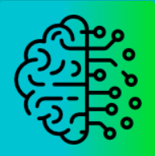

<a name="readme-top"></a>

<!-- PROJECT LOGO -->
<br />
<div align="center">
  <a href="https://github.com/Okazakee/ZTM-smartbrain">
    
  </a>

  <h3 align="center">Smartbrain</h3>

  <p align="center">
    This Magic Site detects faces in your pictures!
    <br />
    <a href="https://smartbrain-okazakee.netlify.app/">View Live Demo</a>
  </p>
</div>

<!-- ABOUT THE PROJECT -->
## About The Project

![Project screenshot][project-screenshot]

This is the last ReactJS website project committed from the [ZTM Web Development Course](https://www.udemy.com/course/the-complete-web-developer-zero-to-mastery/).

### Built With

These are the major frameworks/APIs used in this project.

[![ReactJS][ReactJS]][ReactJS-url]
[![clarifai][clarifai]][clarifai-url]
[![NodeJS][NodeJS]][NodeJS-url]

## How it works
This WebApp was the first attempt on making a fullstack project, it is built with ReactJS in the frontend, NodeJS as backend and Postgress as DB.

It supports registration and the user can detect faces in provided images using the Clarifai REST API, a "Rank" value is increased for each image scanned by the user.

<!-- GETTING STARTED -->
## Getting Started - FRONTEND/BACKEND

* Clone the repo:
```bash
git clone https://github.com/Okazakee/ZTM-smartbrain.git
```

* Install dependencies:
```bash
npm -i
# or
yarn
```

* Run the development server:

```bash
npm run start
# or
yarn start
```

* For Backend, in another terminal run:
```bash
git checkout backend
```

* Install dependencies:
```bash
npm -i
# or
yarn
```

* Run the development server:

```bash
npm run start
# or
yarn start
```

## Getting Started - DATABASE

* Setup your Postgress SQL Database according to the course specifications.

<!-- MARKDOWN LINKS & IMAGES -->
<!-- https://www.markdownguide.org/basic-syntax/#reference-style-links -->
[project-screenshot]: assets/screenshot.png

[ReactJS]: https://img.shields.io/badge/ReactJS-000000?style=for-the-badge&logo=react&logoColor=white
[ReactJS-url]: https://react.dev/

[clarifai]: https://img.shields.io/badge/clarifai-58bfdd?style=for-the-badge&logo=data:image/svg+xml;base64,PD94bWwgdmVyc2lvbj0iMS4wIiBlbmNvZGluZz0idXRmLTgiPz4KPCEtLSBHZW5lcmF0b3I6IEFkb2JlIElsbHVzdHJhdG9yIDI0LjEuMiwgU1ZHIEV4cG9ydCBQbHVnLUluIC4gU1ZHIFZlcnNpb246IDYuMDAgQnVpbGQgMCkgIC0tPgo8c3ZnIHZlcnNpb249IjEuMSIgaWQ9IkNhcGFfMSIgeG1sbnM9Imh0dHA6Ly93d3cudzMub3JnLzIwMDAvc3ZnIiB4bWxuczp4bGluaz0iaHR0cDovL3d3dy53My5vcmcvMTk5OS94bGluayIgeD0iMHB4IiB5PSIwcHgiCgkgdmlld0JveD0iMCAwIDE1OCAxMzQuNCIgc3R5bGU9ImVuYWJsZS1iYWNrZ3JvdW5kOm5ldyAwIDAgMTU4IDEzNC40OyIgeG1sOnNwYWNlPSJwcmVzZXJ2ZSI+CjxzdHlsZSB0eXBlPSJ0ZXh0L2NzcyI+Cgkuc3Qwe2ZpbGw6IzAwNEVFQjt9Cjwvc3R5bGU+CjxnPgoJPHBhdGggY2xhc3M9InN0MCIgZD0iTTE4LjMsODUuNUM4LjIsODUuNSwwLDc3LjQsMCw2Ny4zUzguMiw0OSwxOC4zLDQ5czE4LjIsOC4yLDE4LjIsMTguMlMyOC40LDg1LjUsMTguMyw4NS41eiBNMTEyLjcsMC4zCgkJQzk5LjIsMC4zLDk4LjYsMTEuNyw3OCwxMS43Yy0yMC44LDAtMjIuNS0xMS40LTM0LjgtMTEuNGMtMTAuMSwwLTE4LjIsOC4yLTE4LjIsMTguMnM4LjIsMTguMiwxOC4yLDE4LjIKCQljMTMuNiwwLDE0LjItMTEuNCwzNC44LTExLjRjMjAuOCwwLDIyLjUsMTEuNCwzNC44LDExLjRjMTAuMSwwLDE4LjItOC4yLDE4LjItMTguMlMxMjIuOCwwLjMsMTEyLjcsMC4zeiBNMTEyLjcsOTcuOAoJCWMtMTMuNiwwLTE0LjIsMTEuNC0zNC44LDExLjRjLTIwLjgsMC0yMi41LTExLjQtMzQuOC0xMS40Yy0xMC4xLDAtMTguMiw4LjItMTguMiwxOC4yczguMiwxOC4yLDE4LjIsMTguMgoJCWMxMy42LDAsMTQuMi0xMS40LDM0LjgtMTEuNGMyMC44LDAsMjIuNSwxMS40LDM0LjgsMTEuNGMxMC4xLDAsMTguMi04LjIsMTguMi0xOC4yUzEyMi44LDk3LjgsMTEyLjcsOTcuOHogTTEzOS43LDQ5LjEKCQljLTEzLjcsMC0xMy4yLDEyLTMwLjQsMTJ2MEM5My40LDYxLDkzLjIsNDkuMSw3OCw0OS4xYy05LjUsMC0xNy4zLDguNy0xNy4zLDE4LjJjMCw5LjUsNy45LDE4LjIsMTguMiwxOC4yYzEzLjcsMCwxMy4yLTEyLDMwLjQtMTIKCQl2MGMxNS45LDAsMTYuMSwxMS45LDMxLjQsMTEuOWM5LjUsMCwxNy4zLTguNywxNy4zLTE4LjJDMTU4LDU3LjgsMTUwLjEsNDkuMSwxMzkuNyw0OS4xeiIvPgo8L2c+Cjwvc3ZnPgo=
[clarifai-url]: https://clarifai.com/

[NodeJS]: https://img.shields.io/badge/NodeJS-54a244?style=for-the-badge&logo=nodedotjs&logoColor=white
[NodeJS-url]: https://nodejs.org/
